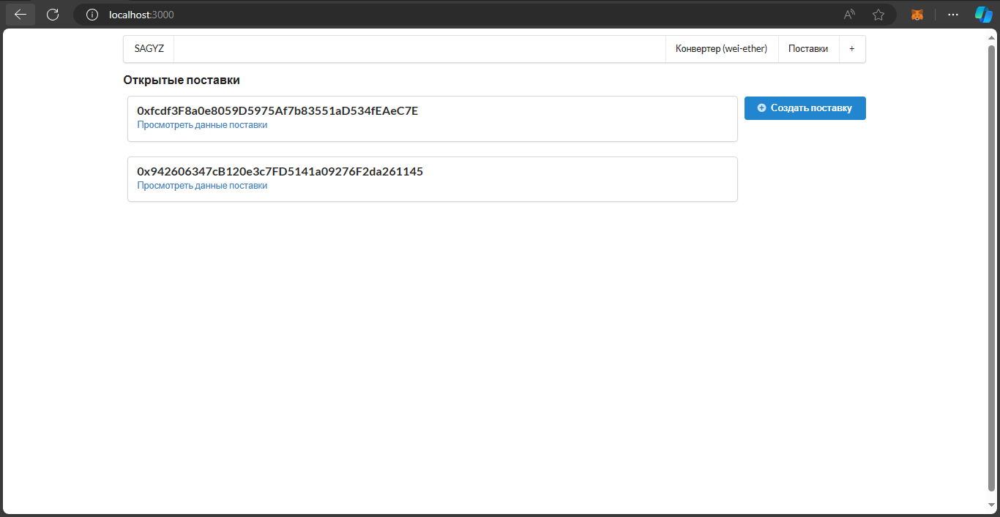

# SAGYZ Blochchain

Примерный прототип блокчейн модуля, который будет использоваться платформой Azamat Digital. Ожидает переработки и доработки в Django.

## Установка
Клонируйте репозиторий и запустите команду `npm install`, чтобы установить все нужные модули
После запустите команду `npm run dev` чтобы запустить сайт.

**ВАЖНО** для взаимодействия с контрактами в сайте - иметь скачанным metamask ([скачать](https://chromewebstore.google.com/detail/nkbihfbeogaeaoehlefnkodbefgpgknn)) в браузере и иметь некоторое количество тестовой валюты (sepoliaETH). Для того, чтобы ее получить введите адрес своего кошелька на [сайте](https://www.infura.io/faucet/sepolia)

[**Доказательство нахождения контракта на блокчейне ethereum'а**](https://sepolia.etherscan.io/address/0xcd65FC3E6CB920c1394686eE997Af71D8CeF4aea)

## Скриншоты сайта
Главная страница

Страница создания поставки

Страница данных поставки

Страница запросов вывода денег

Страница создания запроса
